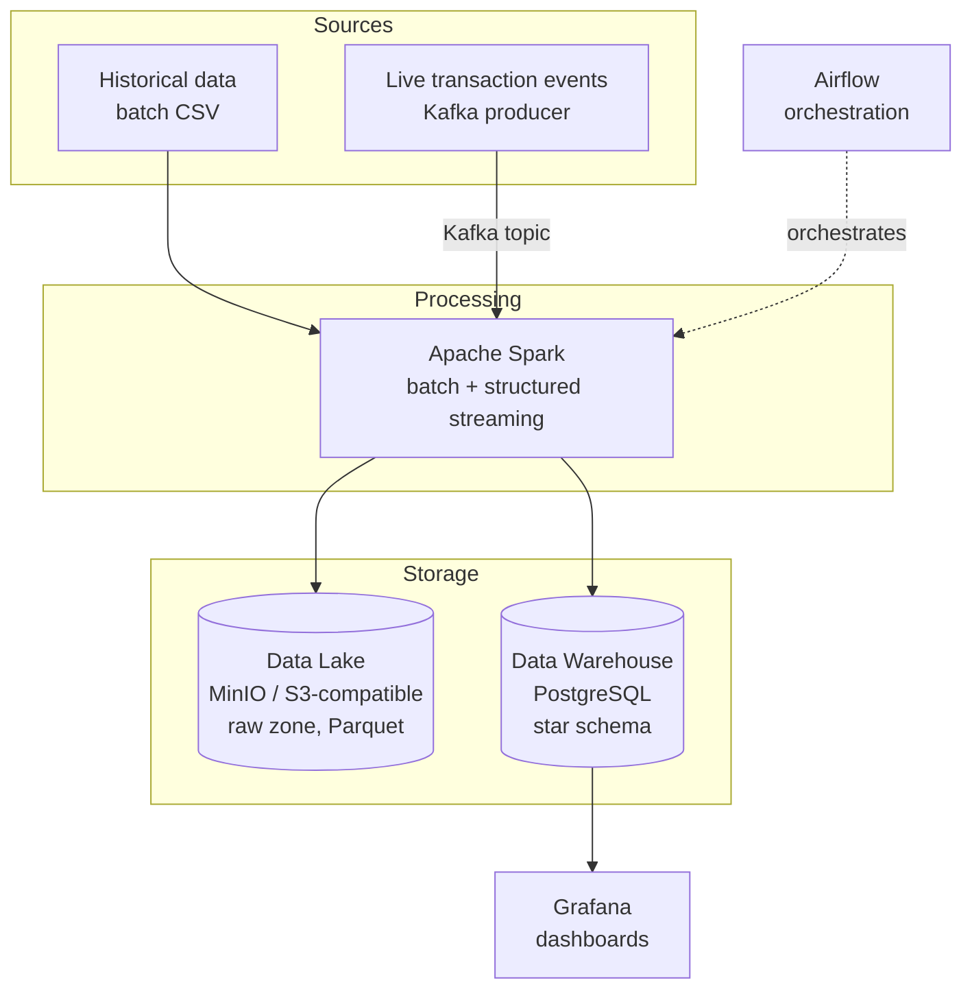

# Real Estate & Land Transaction Data Platform

A batch + streaming data engineering pipeline simulating a real estate / land transaction system, built to demonstrate data infrastructure and architecture skills beyond machine learning: distributed processing, data lake/warehouse design, orchestration, streaming, and monitoring — all containerized and running end to end.

The domain (property transactions, land registration status) was chosen deliberately: it mirrors the kind of data a land registry / cadastre agency actually works with, rather than a generic demo dataset.

## Table of Contents
- [Architecture](#architecture)
- [Tech Stack](#tech-stack)
- [Project Structure](#project-structure)
- [Data Model](#data-model)
- [Key Design Decisions](#key-design-decisions)
- [Running the Project](#running-the-project)
- [Known Limitations & Future Work](#known-limitations--future-work)

## Architecture



The whole stack runs via Docker Compose (14 services), with two independent ingestion paths (batch and streaming) converging on the same processing engine and storage layers.

## Tech Stack

| Layer | Technology | Role |
|---|---|---|
| Batch ingestion | Python (stdlib) | Synthetic historical data generator with documented data quality issues |
| Streaming ingestion | Kafka (KRaft mode) | Real-time transaction event stream |
| Processing | Apache Spark 3.5 (batch + Structured Streaming) | Distributed cleaning, transformation, dimensional modeling |
| Data Lake | MinIO | S3-compatible raw zone storage |
| Data Warehouse | PostgreSQL 16 | Star schema for analytics |
| Orchestration | Apache Airflow 3.3 (LocalExecutor) | Batch pipeline scheduling and monitoring |
| Monitoring / BI | Grafana | Dashboards on top of the Data Warehouse |
| Containerization | Docker Compose | Full local reproducible environment |

## Project Structure

```
real-estate-data-platform/
├── data_generator/        # synthetic transaction data generator (batch mode)
├── etl_batch/              # Spark batch ETL job
├── etl_streaming/          # Kafka producer + Spark Structured Streaming job
├── dags/                    # Airflow DAGs
├── docker/                  # docker-compose.yml, Dockerfiles, .env
├── sql/                     # Data Warehouse star schema DDL
├── monitoring/grafana/      # Grafana datasource/dashboard provisioning
└── README.md
```

## Data Model

Star schema in the Data Warehouse:

- **fact_transactions** — one row per transaction: measures (price, surface) + foreign keys
- **dim_date**, **dim_property_type**, **dim_location**, **dim_registration_status** — descriptive dimensions, each value stored once

This separates numeric measures from descriptive attributes, keeping the fact table narrow and joins/aggregations cheap — the standard shape for a warehouse built for reporting, as opposed to an OLTP schema built for transactional lookups.

`registration_status` (registered / in_progress / disputed) is the field most directly tied to the land registry domain, and drives one of the Grafana dashboard panels.

## Key Design Decisions

- **Synthetic data generation instead of a public dataset**: full control over volume (justifying Spark's distributed processing) and the ability to inject *known, documented* data quality issues (duplicates, inconsistent number formatting, missing values) rather than relying on whatever a downloaded dataset happens to contain.
- **Raw zone (Lake) written before cleaning**: the Lake preserves an unmodified copy of the source data, in Parquet. If a cleaning rule turns out wrong later, reprocessing doesn't require re-extracting from the original source.
- **Nulls preserved, not imputed**: missing `surface_m2` or `city` values are kept as NULL rather than filled in. In a warehouse used for reporting, an invented value would silently corrupt aggregate statistics (AVG, SUM correctly ignore NULLs; they can't detect a fabricated placeholder).
- **Full load, not yet idempotent**: the batch job currently appends; re-running it against non-empty tables will hit primary/unique key violations. This is a known, deliberate scope boundary — see below.
- **Streaming data lands in the Lake only, not yet the Warehouse**: merging streaming events into the star schema requires resolving dimension keys for values that may not exist yet, a harder problem than the batch case where all dimension values are known upfront. Proving the streaming mechanics work end to end (Kafka → Spark Structured Streaming → Lake, with checkpointing) was the goal for this stage.
- **Docker image migrations handled mid-project**: both `bitnami/spark` and `bitnami/kafka` moved to a paid model during development; the project was migrated to the official `apache/spark` and `apache/kafka` images instead — a real-world dependency risk, not a hypothetical one.

## Running the Project

Requires Docker (tested in GitHub Codespaces; Docker Desktop on Windows 10/11 21H2+ also works).

```bash
cd docker
cp .env.example .env
docker compose up -d --build
```

Then, in order:
1. Generate the historical dataset: `python3 data_generator/generate_transactions.py`
2. Apply the warehouse schema: `docker exec -i postgres_dwh psql -U dwh_user -d real_estate_dwh < sql/schema.sql`
3. Run the batch job manually once, or trigger the `real_estate_batch_etl` DAG from the Airflow UI (port 8090)
4. For streaming: run `etl_streaming/producer.py` and `etl_streaming/streaming_etl_job.py` (see inline docstrings for exact spark-submit commands)
5. Grafana dashboard: port 3000 (`admin` / `admin`)

Service ports: MinIO console `9001`, Spark master UI `8080`, Airflow `8090`, Grafana `3000`, PostgreSQL `5432`.

## Known Limitations & Future Work

This project intentionally stops at a defined scope. Left out on purpose, not by oversight:

- **No CI/CD pipeline** (no automated tests, no deployment automation)
- **No Kubernetes** (Docker Compose only — fine for local dev, not for a production deployment target)
- **No cloud deployment** (MinIO simulates S3 locally; the code is S3-API-compatible by design, so pointing it at real AWS S3 would require config changes, not code changes)
- **No automated data quality framework** (cleaning rules are hand-written, not expressed via a tool like Great Expectations or dbt tests)
- **Batch job is not idempotent**: re-running it requires truncating the warehouse tables first. A production version would use an upsert (`ON CONFLICT DO UPDATE`) or delete-then-insert strategy per load window.

These are natural next steps if the project is picked back up, rather than gaps discovered too late.